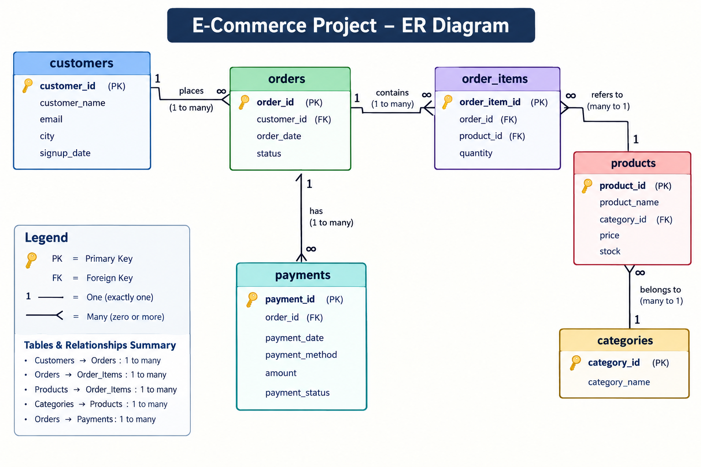

# E-Commerce Sales & Customer Analytics

## Project Overview

This is an end-to-end e-commerce analytics project developed using **MySQL and Power BI**.

The project analyzes transactional data to understand revenue performance, customer behavior, product performance, payment patterns, and inventory risk.

---

## Business Objective

The analysis answers business questions related to:

- Revenue and monthly sales performance
- Product and category performance
- High-value and repeat customers
- Customer segmentation and retention
- City-level revenue performance
- Payment method performance
- Inventory risk
- Month-over-month revenue growth

---

## Tools & Technologies

- **MySQL Workbench** — Database creation and SQL analysis
- **SQL** — JOINs, CTEs, subqueries, CASE statements and window functions
- **Power BI** — Data modelling, DAX and dashboard development
- **Microsoft Excel** — Project data source
- **GitHub** — Project documentation and portfolio presentation

---

## Database Structure

The database contains six relational tables:

- `customers`
- `categories`
- `products`
- `orders`
- `order_items`
- `payments`

### Entity Relationship Diagram

---

## SQL Analysis

The project contains **35 business-focused SQL questions**, covering:

- Core Business Analysis
- Customer Analysis
- Product & Inventory Analysis
- Advanced Analysis & Window Functions
- Business Case Study & Executive Analysis

SQL techniques demonstrated include JOINs, aggregations, CTEs, subqueries, CASE statements, `RANK()`, `DENSE_RANK()`, `ROW_NUMBER()`, `LAG()`, running totals and segmentation.

---

## Power BI Dashboard

### Executive Overview

### Customer & Product Analysis

---

## Key Business Results

- **Total Revenue:** ₹49,765
- **Valid Orders:** 13
- **Average Order Value:** ₹3,828.08
- **Cancellation Rate:** 13.33%
- **Quantity Sold:** 35 units
- **Top Category:** Electronics — ₹17,492 (~35.15% of revenue)
- **Highest-Spending Customer:** Aarav Sharma — ₹11,192
- **High Value Customers:** 3 customers generated ₹29,882 (~60.04% of revenue)
- **Highest-Revenue Product:** Smart Watch — ₹8,997
- **Highest-Selling Product by Quantity:** Sunscreen — 5 units
- **Highest-Revenue City:** Delhi — ₹18,387
- **Largest Paid Payment Method:** UPI — ~44.37%
- **Inventory Risk:** 4 actively selling products have stock below 50 units
- **June MoM Revenue Growth:** -48.63%

The available order data covers only **May–June 2025**, so the monthly decline should not be interpreted as a long-term sales trend.

---

## Repository Structure

Data — Excel project data source

Documentation — Detailed project documentation

Images — ER diagram and Power BI dashboard screenshots

PowerBI — Power BI dashboard file

SQL — Database setup and 35 analytical queries

---

## Key Skills Demonstrated

**SQL:** JOINs, CTEs, subqueries, aggregations, CASE statements, window functions, ranking and time-based analysis

**Power BI:** Data modelling, DAX, KPI development, slicers and dashboard visualization

**Business Analytics:** Revenue analysis, customer segmentation, retention analysis, product performance and inventory analysis

---

## Dataset & Assumptions

This project uses a small structured e-commerce dataset created for portfolio and analytical practice.

Revenue is calculated as:

**Product Price × Quantity Sold**

Cancelled orders are excluded from sales revenue unless explicitly stated otherwise.

---

## Conclusion

This project demonstrates an end-to-end analytics workflow from relational database creation and SQL analysis to business-focused visualization in Power BI.

The project converts transactional data into measurable insights across revenue, customers, products, categories, payments and inventory.
